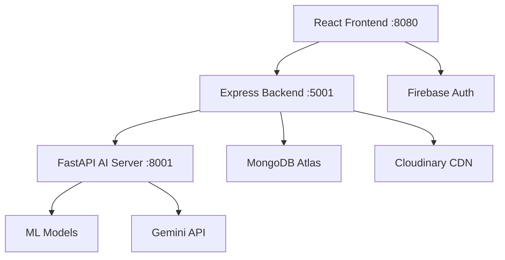

# Wiz Scholar - Technical Documentation & Workflow

## 🏰 Project Overview

**Wiz Scholar** is a Harry Potter-themed educational platform that combines artificial intelligence, machine learning, and modern web technologies to create an immersive learning experience. The platform features a Sorting Hat AI for personalized user categorization, PDF document summarization, and a comprehensive Hogwarts Suite of educational tools.

---

## 🛠️ Tech Stack

### Frontend
- **Framework**: React 18 with Vite
- **UI Components**: Radix UI + Shadcn/ui
- **Styling**: Tailwind CSS with custom house themes
- **Authentication**: Firebase Authentication
- **Routing**: React Router DOM
- **State Management**: React Context API
- **Build Tool**: Vite (Hot Module Replacement, Fast Builds)

### Backend
- **API Server**: Express.js (Node.js)
- **Database**: MongoDB with Mongoose ODM
- **File Storage**: Cloudinary for PDF management
- **PDF Processing**: pdf-parse library
- **Cross-Origin**: CORS enabled for frontend communication
- **Environment**: dotenv for configuration management

### AI/ML Services
- **Framework**: FastAPI (Python)
- **Machine Learning**: scikit-learn for Sorting Hat model
- **Natural Language**: NLTK for text processing
- **AI Integration**: OpenAI GPT for intelligent responses
- **Model Storage**: joblib for ML model serialization
- **Data Processing**: pandas, numpy for data manipulation

### Infrastructure & Deployment
- **Development Server**: Vite dev server (Frontend)
- **API Server**: Express.js on port 5001
- **AI Server**: FastAPI with uvicorn on port 8001
- **Database**: MongoDB Atlas (Cloud)
- **File Storage**: Cloudinary CDN
- **Environment**: Multi-service architecture

---

## 🏗️ Project Architecture & Workflow

### Directory Structure
```
Wiz-Scholar-Srujal/
├── wiz-scholar-landing-page/     # React Frontend
│   ├── src/
│   │   ├── components/           # Reusable UI components
│   │   ├── pages/               # Route components
│   │   ├── hooks/               # Custom React hooks
│   │   ├── lib/                 # Utility functions
│   │   └── assets/              # Static images/files
│   ├── public/                  # Static assets
│   └── vite.config.js          # Vite configuration
├── server/                      # Express.js Backend
│   ├── routes/                  # API route handlers
│   ├── utils/                   # Backend utilities
│   ├── middlewares/             # Express middlewares
│   └── server.js               # Main server file
├── ai_server/                   # FastAPI AI Service
│   ├── main.py                 # AI server entry point
│   └── requirements.txt        # Python dependencies
└── Sorting_Hat/                # ML Model & Data
    ├── enhanced_sorting_hat_model.joblib
    ├── Question_Bank.csv
    └── train_enhanced.py
```

### Service Communication Flow



### Request Lifecycle

1. **User Interaction**: User interacts with React frontend
2. **Authentication**: Firebase handles user authentication
3. **API Requests**: Frontend sends requests to Express backend
4. **Data Processing**: Backend processes requests, handles file uploads
5. **AI Processing**: Backend forwards AI requests to FastAPI server
6. **ML Inference**: AI server runs Sorting Hat model or PDF processing
7. **Response Chain**: Results flow back through the stack to the user

---

## 🎓 Sorting Hat ML Model

### Overview
The Sorting Hat is a sophisticated machine learning system that assigns users to one of the four Hogwarts houses based on their personality traits and responses to carefully crafted questions.

### Technical Implementation

#### Model Architecture
- **Algorithm**: Enhanced Random Forest Classifier
- **Fallback**: Decision Tree Classifier for basic functionality
- **Training Data**: 2000+ synthetic samples based on house characteristics
- **Features**: 9 personality dimensions per house

#### House Characteristics Matrix
```python
house_profiles = {
    'Gryffindor': {
        'bravery_score': (7, 10),      # High courage and valor
        'wisdom_score': (4, 8),        # Moderate wisdom
        'ambition_score': (5, 9),      # Strong drive
        'loyalty_score': (6, 9),       # High loyalty to ideals
        'leadership': (6, 10),         # Natural leadership
        'impulsiveness': (6, 9),       # Quick decision making
        'justice_oriented': (7, 10),   # Strong moral compass
        'risk_taking': (7, 10),        # High risk tolerance
        'honor_focused': (7, 10),      # Values honor highly
    },
    'Hufflepuff': {
        'loyalty_score': (8, 10),      # PRIMARY: Highest loyalty
        'justice_oriented': (6, 9),    # Strong sense of fairness
        'impulsiveness': (2, 5),       # More thoughtful/patient
        'risk_taking': (3, 6),         # More cautious approach
        # ... other traits
    },
    'Ravenclaw': {
        'wisdom_score': (8, 10),       # PRIMARY: Highest intelligence
        'ambition_score': (6, 9),      # Knowledge-focused ambition
        'creativity': (7, 10),         # High creative thinking
        'curiosity': (8, 10),          # Strong desire to learn
        # ... other traits
    },
    'Slytherin': {
        'ambition_score': (8, 10),     # PRIMARY: Highest ambition
        'leadership': (7, 10),         # Strong leadership drive
        'strategic_thinking': (7, 10), # Cunning and planning
        'resourcefulness': (7, 10),    # Finding creative solutions
        # ... other traits
    }
}
```

#### Question Bank System
- **Total Questions**: 15 carefully crafted questions
- **Question Types**: Scenario-based, preference-based, ethical dilemmas
- **Scoring System**: Multi-dimensional trait scoring
- **Adaptive Logic**: Questions selected based on previous responses

#### Model Training Process
1. **Data Generation**: Synthetic data based on psychological profiles
2. **Feature Engineering**: Convert responses to numerical trait scores
3. **Model Training**: Random Forest with cross-validation
4. **Validation**: Accuracy testing and confusion matrix analysis
5. **Serialization**: Save model using joblib for production use

#### API Integration
```python
# FastAPI endpoint structure
@app.post("/api/sorting-hat/sort")
async def sort_user(responses: SortingRequest):
    # Process user responses
    trait_scores = calculate_trait_scores(responses.answers)
    
    # Run ML model inference
    prediction = sorting_hat_model.predict([trait_scores])
    probabilities = sorting_hat_model.predict_proba([trait_scores])
    
    # Return house assignment with confidence
    return {
        "house": prediction[0],
        "confidence": max(probabilities[0]),
        "house_probabilities": dict(zip(houses, probabilities[0]))
    }
```

---

## 📄 PDF Summarizer System

### Architecture Overview
The PDF Summarizer is a comprehensive document processing pipeline that handles PDF upload, text extraction, and AI-powered summarization.

### Technical Implementation

#### Component Stack
1. **Frontend Upload**: React drag-and-drop interface with progress tracking
2. **Express Middleware**: Multer for multipart form handling
3. **Cloud Storage**: Cloudinary for PDF storage and CDN delivery
4. **Text Extraction**: pdf-parse library for content extraction
5. **AI Processing**: OpenAI GPT integration for intelligent summarization

#### Processing Pipeline
```javascript
// Complete PDF processing workflow
const processPDF = async (file) => {
    // 1. Upload to Cloudinary
    const cloudinaryResult = await uploadPDFToCloudinary(fileBuffer, fileName);
    
    // 2. Extract text content
    const extractedText = await extractTextFromPDF(fileBuffer);
    
    // 3. Send to AI server for summarization
    const summary = await summarizeWithGemini(extractedText, summaryType);
    
    // 4. Return structured response
    return {
        pdf_url: cloudinaryResult.secure_url,
        extracted_text: extractedText,
        summary: summary,
        metadata: {
            pages: extractedText.split('\f').length,
            word_count: extractedText.split(' ').length,
            processing_time: Date.now() - startTime
        }
    };
};
```

#### Cloudinary Integration
```javascript
const uploadPDFToCloudinary = async (fileBuffer, fileName) => {
    return new Promise((resolve, reject) => {
        cloudinary.uploader.upload_stream({
            resource_type: 'raw',           // Handle non-image files
            folder: 'wiz-scholar/pdfs',     // Organized storage
            public_id: `pdf_${Date.now()}_${fileName}`,
            use_filename: true,
            content_type: 'application/pdf',
            disposition: 'inline',          // Allow browser viewing
        }, (error, result) => {
            if (error) reject(error);
            else resolve(result);
        }).end(fileBuffer);
    });
};
```

#### AI Summarization Features
- **Multiple Summary Types**: Academic, Brief, Detailed, Bullet Points
- **Context Preservation**: Maintains document structure and key concepts
- **Question Answering**: Interactive Q&A based on document content
- **Custom Prompts**: Tailored prompts for educational content

#### Frontend Integration
```jsx
const PDFSummarizerPanel = () => {
    const [file, setFile] = useState(null);
    const [summary, setSummary] = useState(null);
    const [loading, setLoading] = useState(false);

    const handleFileUpload = async (selectedFile) => {
        const formData = new FormData();
        formData.append('pdf', selectedFile);
        formData.append('summary_type', summaryType);

        const response = await fetch('/api/upload-pdf', {
            method: 'POST',
            body: formData
        });

        const result = await response.json();
        setSummary(result);
    };

    // Drag-and-drop, progress tracking, error handling
    return (
        <div className="pdf-summarizer">
            {/* Upload interface, progress bar, results display */}
        </div>
    );
};
```

---

## 🏰 Hogwarts Suite System

### Overview
The Hogwarts Suite is a comprehensive collection of educational tools designed with Harry Potter theming, providing students with various utilities for academic success.

### House-Based Theming System

#### Dynamic Theme Implementation
```javascript
// houseThemes.js - Centralized theme management
export const houseThemes = {
    gryffindor: {
        primary: '#D4AF37',      // Gold
        secondary: '#DC143C',     // Crimson
        gradient: 'from-red-600 via-yellow-500 to-red-700',
        bgGradient: 'from-red-900/20 via-yellow-900/10 to-red-900/20',
        textPrimary: 'text-yellow-400',
        textSecondary: 'text-red-300',
        accent: 'border-yellow-400',
        house: 'Gryffindor',
        traits: ['Brave', 'Daring', 'Chivalrous', 'Courageous']
    },
    hufflepuff: {
        primary: '#F0C040',      // Yellow
        secondary: '#4A4A4A',     // Charcoal
        gradient: 'from-yellow-600 via-yellow-400 to-amber-600',
        bgGradient: 'from-yellow-900/20 via-amber-900/10 to-yellow-900/20',
        textPrimary: 'text-yellow-300',
        textSecondary: 'text-amber-200',
        accent: 'border-yellow-400',
        house: 'Hufflepuff',
        traits: ['Loyal', 'Patient', 'Fair', 'Hard-working']
    },
    // ... Ravenclaw and Slytherin themes
};
```

### Features Dashboard
```jsx
const FeaturesSection = () => {
    const { userHouse, currentTheme } = useAuth();
    
    return (
        <div className={`min-h-screen bg-gradient-to-br ${currentTheme.bgGradient}`}>
            {/* Dynamic background based on user's house */}
            
            <div className="personalized-header">
                <h1 className={currentTheme.textPrimary}>
                    Welcome to {currentTheme.house} House, {user.displayName}!
                </h1>
                <div className={`house-traits ${currentTheme.accent}`}>
                    {currentTheme.traits.map(trait => (
                        <span key={trait} className={currentTheme.textSecondary}>
                            {trait}
                        </span>
                    ))}
                </div>
            </div>
            
            {/* Feature cards with house-themed styling */}
            <div className="features-grid">
                {features.map(feature => (
                    <FeatureCard 
                        key={feature.title}
                        {...feature}
                        theme={currentTheme}
                    />
                ))}
            </div>
        </div>
    );
};
```

### Educational Tools Collection

#### Current Tools
1. **Sorting Hat AI**: Personality-based house assignment
2. **Document Summarizer**: PDF processing and AI summarization
3. **Interactive Dashboard**: Personalized learning environment
4. **Progress Tracking**: User journey and achievement system

#### Planned Extensions
- **Spell Checker**: Grammar and writing assistance
- **Potion Calculator**: Mathematical computation tools
- **Study Planner**: Academic scheduling system
- **Quiz Generator**: Interactive learning assessments

---

## 🔄 Development Workflow

### Local Development Setup
```bash
# 1. Frontend Development
cd wiz-scholar-landing-page
npm install
npm run dev              # Starts Vite dev server on :8080

# 2. Backend API Server
cd server
npm install
npm start               # Starts Express server on :5001

# 3. AI/ML Server
cd ai_server
pip install -r requirements.txt
python main.py          # Starts FastAPI server on :8001
```

### Environment Configuration
```properties
# .env configuration
MONGODB_URI=mongodb+srv://...
PORT=5001
NODE_ENV=development

# Cloudinary Configuration
CLOUDINARY_CLOUD_NAME=your_cloud_name
CLOUDINARY_API_KEY=your_api_key
CLOUDINARY_API_SECRET=your_api_secret

# AI Server Configuration
AI_SERVER_URL=http://localhost:8001
GEMINI_API_KEY=your_gemini_key
```

### Build & Deployment Process
```bash
# Frontend Production Build
cd wiz-scholar-landing-page
npm run build           # Creates dist/ folder with optimized assets

# Backend Production Deployment
cd server
npm start              # Production Express server

# AI Server Production
cd ai_server
uvicorn main:app --host 0.0.0.0 --port 8001
```

---

## 🔐 Security & Authentication

### Firebase Authentication
- **Providers**: Email/Password, Google OAuth
- **Session Management**: Persistent login with Firebase tokens
- **User Profiles**: Extended user data in Firestore
- **House Assignment**: Secure storage of sorting results

### Data Protection
- **API Security**: CORS configuration for allowed origins
- **File Upload**: Secure PDF handling with size limits
- **Environment Variables**: Sensitive data protection
- **Input Validation**: Sanitization of user inputs

---

## 📊 Performance Optimizations

### Frontend Optimizations
- **Vite Build**: Tree shaking and code splitting
- **Lazy Loading**: Route-based code splitting
- **Asset Optimization**: Image compression and CDN delivery
- **Caching**: Browser caching for static assets

### Backend Optimizations
- **Database**: MongoDB indexing for fast queries
- **File Storage**: Cloudinary CDN for global delivery
- **API Caching**: Response caching for frequently accessed data
- **Connection Pooling**: Database connection optimization

### AI/ML Optimizations
- **Model Caching**: Pre-loaded models in memory
- **Batch Processing**: Efficient inference for multiple requests
- **Response Caching**: Cache common AI responses
- **Async Processing**: Non-blocking AI operations

---

## 🔮 Future Enhancements

### Planned Features
1. **Advanced Analytics**: Learning progress tracking
2. **Social Features**: House-based communities
3. **Mobile App**: React Native companion app
4. **Voice Integration**: Voice-activated sorting hat
5. **Gamification**: Points, badges, and achievements
6. **Multi-language**: International wizard support

### Technical Improvements
1. **Microservices**: Service decomposition for scalability
2. **GraphQL**: Advanced API query capabilities
3. **Real-time**: WebSocket integration for live features
4. **Testing**: Comprehensive test coverage
5. **CI/CD**: Automated deployment pipeline
6. **Monitoring**: Application performance monitoring

---

## 📚 API Documentation

### Sorting Hat Endpoints
```
POST /api/sorting-hat/questions
- Get next question based on current responses
- Body: { responses: Array<{questionId, answer}> }

POST /api/sorting-hat/sort
- Complete sorting process and get house assignment
- Body: { responses: Array<{questionId, answer}> }

GET /api/sorting-hat/houses
- Get information about all Hogwarts houses
```

### PDF Processing Endpoints
```
POST /api/upload-pdf
- Upload and process PDF document
- Form Data: { pdf: File, summary_type: String }

POST /api/summarize-pdf-url
- Summarize PDF from URL
- Body: { pdf_url: String, summary_type: String }

POST /api/ask-pdf-question
- Ask question about uploaded PDF
- Body: { pdf_url: String, question: String }
```

### Authentication Endpoints
```
POST /api/auth/register
- Register new user account
- Body: { email: String, password: String, displayName: String }

POST /api/auth/login
- User login authentication
- Body: { email: String, password: String }

GET /api/user/profile
- Get user profile with house information
- Headers: { Authorization: Bearer token }
```

---

## 🧪 Testing Strategy

### Frontend Testing
- **Unit Tests**: Component testing with React Testing Library
- **Integration Tests**: User interaction flows
- **E2E Tests**: Complete user journey testing
- **Visual Testing**: Component screenshot comparison

### Backend Testing
- **Unit Tests**: Route handler and utility function tests
- **Integration Tests**: Database and external API testing
- **Load Testing**: Performance under high traffic
- **Security Testing**: Vulnerability assessment

### AI/ML Testing
- **Model Validation**: Accuracy and precision metrics
- **Data Testing**: Training data quality assurance
- **Performance Testing**: Inference speed optimization
- **Bias Testing**: Fairness across different user groups

---

This comprehensive documentation provides a complete overview of the Wiz Scholar project, covering all major components, technical decisions, and implementation details. The system demonstrates a sophisticated integration of modern web technologies with AI/ML capabilities, all wrapped in an engaging Harry Potter-themed educational experience.
